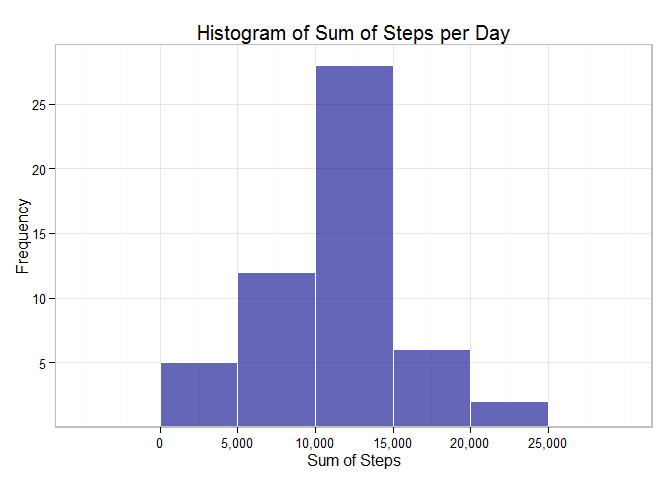
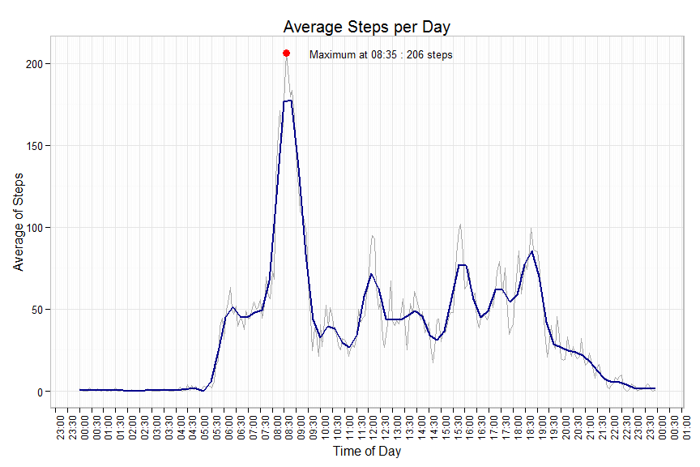
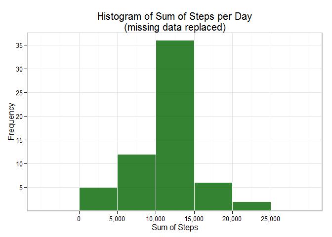
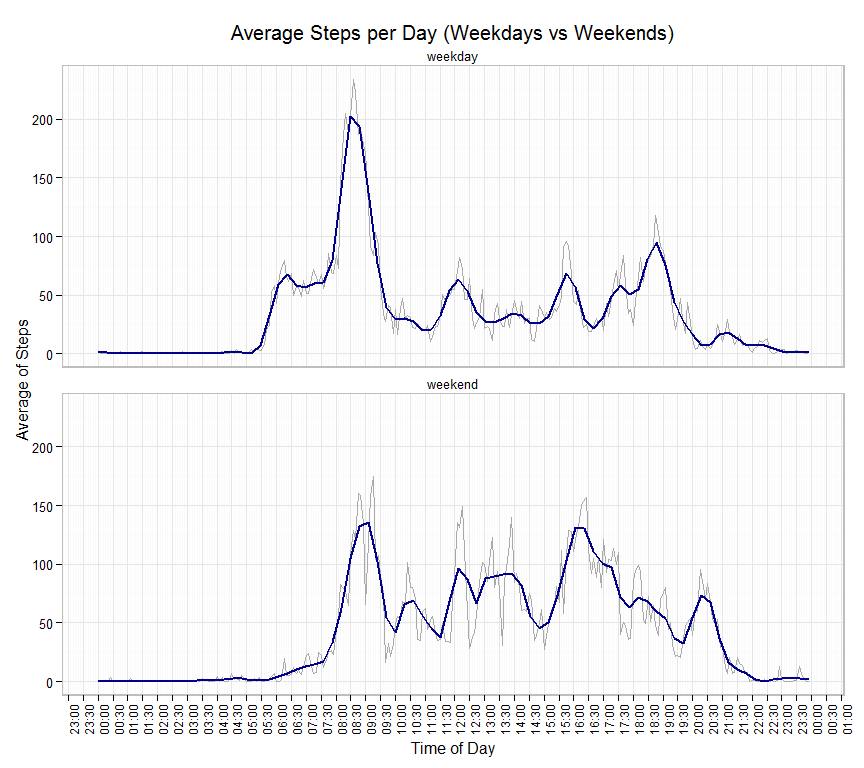

# Reproducible Research: Peer Assessment 1
Chris Palmer  
Wednesday, July 15, 2015  
## Introduction

This is a Coursera assignment for the Reproducible Research module, which makes
use of data from a personal activity monitoring device.

The objective of the assignment is to report on various aspects of the data via
a report published using **knitr**, which allows commentary and code to be weaved
together in order to produce a document that integrates human and machine readable
instructions. This illustrates the goal of reproducible research using literate 
programming, which is for data, code and analysis to be available together so that 
a reader can reproduce the research.

The specifications and data for the assignment are available on GitHub - see Reference 1.

The device collects data at 5 minute intervals throughout the day.
The data consists of two months of data from an anonymous individual collected
during the months of October and November 2012 and includes the number of steps
taken in 5 minute intervals each day.

The variables included in the dataset are:

steps: Number of steps taking in a 5-minute interval (missing values are coded as NA)

date: The date on which the measurement was taken in YYYY-MM-DD format

interval: Numeric identifier for the 5-minute interval in which measurement was taken

The dataset is stored in a comma-separated-value (CSV) file, there are a total
of 17,568 observations in the dataset.

The document sections deal with loading the data and performing various
analysis of it, then plotting and commentry of the analytical results.

## Loading and preprocessing the data

The following code reads the data in activity.csv into a table, then creates
a subset of the data that excludes invalid (NA) data:


```r
suppressPackageStartupMessages({
library(data.table)
library(scales)
library(ggplot2)
})

csv_file <- "activity.csv"
zip_file <- "activity.zip"

if (!file.exists(csv_file))
    if (!file.exists(zip_file)) {
        stop("Requires activity.csv")
        } else {
            unzip(zip_file, "activity.csv")
    }

# Read csv file into data.table activitytable
activitytable <- data.table(read.csv("activity.csv",
                                     header=TRUE, na.strings = "NA"))

# Preserve original interval as ninterval
activitytable$ninterval <- activitytable$interval
# Add extra column of character based interval as cinterval
activitytable$cinterval <-
    paste0(substring(sprintf("%004d", activitytable$interval), 1, 2),
    ":",
    substring(sprintf("%004d", activitytable$interval), 3, 4))
# Reset interval as a factor of cinterval
activitytable$interval <-
    factor(activitytable$cinterval)
# Add a datetime field for time series charting - make time zone explicit
# for consistency/reliability when using time values...
activitytable$datetime <-
    as.POSIXct(paste(activitytable$date, activitytable$cinterval),
               format= "%Y-%m-%d %H:%M", tz="Australia/Sydney")
# Format date field as a date
activitytable$date <-
    as.Date(activitytable$date, format= "%Y-%m-%d", tz="Australia/Sydney")

# Subset the original data by excluding all NAs - we want to create
# summary information but don't want to skew values by including zeroized NAs
goodActivity <- activitytable[complete.cases(activitytable),]

# Create some variables to use in setting plot time scales
# See Reference 2
date_today <- Sys.Date( )
time1 <- strptime(paste(date_today, "00:00:00 AEST"), "%Y-%m-%d %H:%M:%S")
time2 <- strptime(paste(date_today, "23:55:00 AEST"), "%Y-%m-%d %H:%M:%S")
xlimt <- as.POSIXct(c(time1, time2), origin="1970-01-01", tz="Australia/Sydney")
```

##
##

## What is mean total number of steps taken per day?

The subsetted good data is used to calculate means and medians, and is plotted 
as a histogram:


```r
# Calculate and report the mean and median of the total no. steps taken per day
stepsperday  <- goodActivity[, .(StepSum = sum(steps)), by= .(date)]

# calculate the mean and median of the sum of steps per day
stepSums  <- stepsperday[,  .(stepsTotal = sum(StepSum)
                             ,stepsMean = mean(StepSum)
                             ,stepsMedian = median(StepSum))]

# create a histogram of the sum of steps per day
plt <- ggplot(stepsperday, aes(x=StepSum)) +
       geom_histogram(binwidth = 5000,
                      fill = "darkblue",
                      col = "white",
                      alpha = 0.6) +
       ggtitle("Histogram of Sum of Steps per Day") +
       labs(x="Sum of Steps", y="Frequency") +
       scale_y_discrete(breaks = c(5, 10, 15, 20, 25, 30, 35)) +
       scale_x_continuous(breaks =
            c(0, 5000, 10000, 15000, 20000, 25000), labels = comma) +
       theme_minimal() +
       theme(plot.title = element_text(size = rel(1.25)),
             panel.border = element_rect(colour = "grey", fill=NA, size=1))

print(plt)
```

 


Steps Measurement           | Value
------------------          | -----------------
Total number of steps       | 570608
Mean of the total steps     | 10766.18868
Median of the total steps   | 10765.00000

##
##

## What is the average daily activity pattern?

The data is summarized over all days and plotted as a time series graph in terms
of 5 minute intervals per day:


```r
# calculate the mean of the steps per time interval over all days
# including all variations of interval fields in case they are required
stepspertime <- goodActivity[, .(intervalMean = mean(steps)),
                             by= .(interval, ninterval, cinterval)]
# create a datetime variable for plotting a time series chart, using the
# combination of today's date and the interval value
# (date is irrelevant here - it is just to carry the time interval)
stepspertime$datetime <- as.POSIXct(paste(date_today,
                                          paste0(stepspertime$cinterval, ":00")),
                                    format= "%Y-%m-%d %H:%M:%S",
                                    tz="Australia/Sydney")

# calculate the maximum Mean, and the Interval at which it occurs
MaxMeanRecord <- subset(stepspertime, intervalMean ==
                            max(stepspertime$intervalMean))
maxInterval   <- MaxMeanRecord[, cinterval]
maxnInterval  <- MaxMeanRecord[, ninterval]
maxMean       <- MaxMeanRecord[, intervalMean]

# prepare label for chart point
MaxMeanLabel  <-
    paste("                                                          ",
          "Maximum at", maxInterval, ":",
          as.character(round(maxMean, 0)), "steps")

# set up a field to carry values to inform the plot about the maximum point
# so that it can be coloured differently and labelled
# See Reference 3
stepspertime$highlight <- ifelse(stepspertime$intervalMean == maxMean,
                                 "highlight", "normal")
# just plotting the maximum point, as points are cluttering the chart
stepcolor <- c("highlight" = "red", "normal" = "white")
stepalpha <- c("highlight" = "1", "normal" = "0")

plt <- ggplot(stepspertime, aes(datetime, intervalMean)) +
       geom_line(color = I("darkgrey"), alpha = I(1)) +
       geom_line(se = FALSE, span = 0.08, size = 1,
            stat="smooth", color = "darkblue", method = "loess") +
       geom_point(aes(colour = highlight, alpha = highlight), size = I(3)) +
       scale_color_manual("Status", values = stepcolor) +
       scale_alpha_manual("Status", values = stepalpha) +
       geom_text(data = MaxMeanRecord,
       aes(x = datetime, y = intervalMean, label = MaxMeanLabel, size = 5)) +
       scale_x_datetime(breaks = date_breaks("30 min"),
                        minor_breaks=date_breaks("5 min")
                        ,labels=date_format("%H:%M", tz = "Australia/Sydney")
                        ,limits=xlimt
                        ) +
       ggtitle("Average Steps per Day") +
       labs(x="Time of Day", y="Average of Steps") +
       theme_minimal() +
       theme(legend.position = "none") +
       theme(axis.text.x = element_text(angle = 90, hjust = 1, size = 9),
             plot.title = element_text(size = rel(1.25)),
             panel.border = element_rect(colour = "grey", fill=NA, size=1))

print(plt)
```

 

A smoothed conditional mean line has been fitted to assist in visualizing activity patterns

The maximum number of steps on average is 206, which occurs at 08:35

##
##

## Imputing missing values

Using the subsetted good data, calculate a mean per 5 minute interval, and use
this as the basis for supplying a value to the NAs, so that the entire data set
can be reported on. Plot the fixed entire data in a histogram, and comment on
the differences to the previous subset of good data:


```r
# report on NAs in the original data, then fix them with a mean per interval slot
NA_Rows <- sum(is.na(activitytable$steps) == TRUE)

# Missing data Can be also expressed in terms of days, including days per week 
# and weekend
NA_days <- activitytable[is.na(activitytable$steps) == TRUE, 
                         .(uniqdays=length(unique(date)))]
NA_Weekdays <- activitytable[is.na(activitytable$steps) == TRUE & 
                !(weekdays(activitytable$date) %in% c("Saturday", "Sunday")), 
                          .(uniqdays=length(unique(date)))]
NA_Weekends <- activitytable[is.na(activitytable$steps) == TRUE & 
                 (weekdays(activitytable$date) %in% c("Saturday", "Sunday")), 
                         .(uniqdays=length(unique(date)))]

# calculate the mean of steps per interval slot over all good data
meanStepsperInterval <- goodActivity[, .(StepMean = mean(steps)), by= .(cinterval)]
```


Taking into consideration that we are being asked to report on differences in
activity between weekdays and weekends, also calculate the mean for each of
weekdays and weekends, to test the effect of a more targeted fix:


```r
meanStepsperWeekday <- goodActivity[
                    !(weekdays(goodActivity$date) %in% c("Saturday", "Sunday")),
                             .(StepMean = mean(steps)), 
                               by= .(cinterval)]
meanStepsperWeekend <- goodActivity[
                     (weekdays(goodActivity$date) %in% c("Saturday", "Sunday")),
                              .(StepMean = mean(steps)),
                                by= .(cinterval)]

MeanAlldays <- meanStepsperInterval[, .(mean(StepMean))]
MeanWeekday <- meanStepsperWeekday[, .(mean(StepMean))]
MeanWeekend <- meanStepsperWeekend[, .(mean(StepMean))]
```

Mean of Steps per 5 minute slot | Value
--------------------------      | -----------------
Mean over all days              | 37.3828654
Mean over weekdays              | 35.337963
Mean over weekends              | 43.0784493

The conclusion is that we should use a targeted approach per weekday/weekend split when updating our NAs.


```r
# copy starting data set into a complete set with NAs, then substitute them
# based on a match on interval into the table of means
# See Reference 4
activitytablefixed <- activitytable

# firstly, do the fix using the mean of All Steps irrespective of day of week, 
# for comparitive purposes
activitytablefixed$Allsteps <- ifelse(is.na(activitytablefixed$steps),
                                   meanStepsperInterval$StepMean[
                                       match(activitytablefixed$cinterval,
                                   	   meanStepsperInterval$cinterval)],
                                   activitytablefixed$steps)

# calculate the sum of the steps per day for each day on fixed data set 
# using all days mean
stepsperAllfixed <- activitytablefixed[, .(StepSum = sum(Allsteps)), by= .(date)]

# calculate the mean and median of the sum of steps per day
stepSumsAllfixed <- stepsperAllfixed[,  .(stepsTotal = sum(StepSum)
                                         ,stepsMean = mean(StepSum)
                                         ,stepsMedian = median(StepSum))]

# secondly, fix using the mean of weekday/weekend applied against weekday/weekend
activitytablefixed$steps <-
    ifelse(is.na(activitytablefixed$steps),
       ifelse(!(weekdays(activitytablefixed$date) %in% c("Saturday", "Sunday")),
                meanStepsperWeekday$StepMean[match(activitytablefixed$cinterval,
                                           meanStepsperWeekday$cinterval)],
                meanStepsperWeekend$StepMean[match(activitytablefixed$cinterval,
                                           meanStepsperWeekend$cinterval)]),
    activitytablefixed$steps)

# calculate the sum of the steps per day for each day on fixed data set
stepsperdayfixed <- activitytablefixed[, .(StepSum = sum(steps)), by= .(date)]

# calculate the mean and median of the sum of steps per day
stepSumsfixed <- stepsperdayfixed[,  .(stepsTotal = sum(StepSum)
                                      ,stepsMean = mean(StepSum)
                                      ,stepsMedian = median(StepSum))]


# create a histogram of the sum of steps per day for the fixed data set
plt <- ggplot(stepsperdayfixed, aes(x=StepSum)) +
  geom_histogram(binwidth = 5000,
                 fill = "darkgreen",
                 col = "white",
                 alpha = 0.8) +
  ggtitle("Histogram of Sum of Steps per Day\n(missing data replaced)") +
  labs(x="Sum of Steps", y="Frequency") +
  scale_y_discrete(breaks = c(5, 10, 15, 20, 25, 30, 35)) +
  scale_x_continuous(breaks = c(0, 5000, 10000, 15000, 20000, 25000), labels = comma) +
  theme_minimal() +
  theme(plot.title = element_text(size = rel(1.25), hjust = 0.5),
        panel.border = element_rect(colour = "grey", fill=NA, size=1))

print(plt)
```

 

There were 2304 rows containing NA in the steps value.

The NAs were split over 8 days, consisting of 6 week days, and 2 weekend days.

NAs were replaced with mean values calculated over a weekday/weekend split per 5 minute slot from the previously reported data.

The main effect of adding in missing data is to increase the total steps taken, mean has decreased slightly.

The median calculation has decreased to a greater extent. This is likely the effect of the greater volume of fixed data being in weekdays, when the overall activity is lower.

Steps Measurement   | New Value (mean from weekday/end split)        | Value without weekday/end split | Previous Value
------------------  | -----------                                    | --------------------------      | ----------------------    
Total no. of steps  | 656485  | 656485    |570608
Mean of the total   | 10762.05224   | 10766.19872  | 10766.18868
Median of the total | 10571.00000 | 10766.26524| 10765.00000

##
##

## Are there differences in activity patterns between weekdays and weekends?

Show the differences in activity patterns between week days and weekends:


```r
# plot the differences in activity over week days vs weekends
activitytablefixed$daytype <- factor(
         ifelse(weekdays(activitytablefixed$date) %in% c("Saturday", "Sunday"),
                         "weekend", "weekday"))

# calculate the mean of the steps per time interval over all days
stepspertimefixed <- activitytablefixed[, .(intervalMean = mean(steps)),
                             by= .(daytype, interval, ninterval, cinterval)]

# create a datetime variable for plotting a time series chart, using the
# combination of today's date and the interval value
# (date is irrelevant here - it is just to carry the time interval)
stepspertimefixed$datetime <- as.POSIXct(paste(date_today,
                                         paste0(stepspertimefixed$cinterval, ":00")),
                                    format= "%Y-%m-%d %H:%M:%S",
                                    tz="Australia/Sydney")

pltf <- ggplot(stepspertimefixed, aes(datetime, intervalMean)) +
        geom_line(color = I("darkgrey"), alpha = I(1)) +
        geom_smooth(se = FALSE, span = 0.08, color = "darkblue", 
                    size = 1, method="loess") +
        scale_x_datetime(breaks = date_breaks("30 min"),
                   minor_breaks=date_breaks("5 min")
                   ,labels=date_format("%H:%M", tz = "Australia/Sydney")
                   ,limits=xlimt
         ) +
        ggtitle("Average Steps per Day (Weekdays vs Weekends)") +
        labs(x="Time of Day", y="Average of Steps") +
        theme_minimal() +
        theme(legend.position = "none") +
        theme(axis.text.x = element_text(angle = 90, hjust = 1, size = 9),
              plot.title = element_text(size = rel(1.25)),
              panel.border = element_rect(colour = "grey", fill=NA, size=1))

print(pltf + facet_wrap(~daytype, ncol = 1))
```

 

Smoothed conditional mean lines have been fitted to assist in visualizing activity patterns

Weekdays activities start earlier and peak in early morning but have overall less activity as the day progresses

Weekends activities are overall greater with peaks of activity in mid-morning and late afternoon

##
##

### References:

1. https://github.com/rdpeng/RepData_PeerAssessment1

2. https://jonkimanalyze.wordpress.com/2014/03/25/ggplot2-time-series-axis-control-breaks-label-limitshttpsjonkimanalyze-wordpress-comwp-adminedit-phpinline-edit

3. http://stackoverflow.com/questions/14351608/color-one-point-and-add-an-annotation-in-ggplot2

4. http://stackoverflow.com/questions/19593881/replace-na-values-in-dataframe-variable-with-values-from-other-dataframe-by-id
